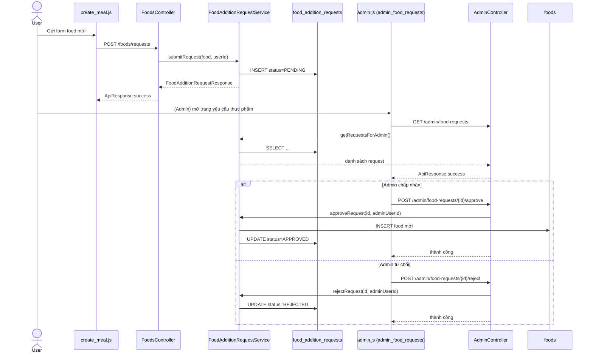

# Luồng chức năng: User gửi yêu cầu thêm food, Admin chấp nhận/từ chối

Tài liệu này là bản đầy đủ (có dấu) mô tả chi tiết luồng chạy trong code cho chức năng:

- User không được thêm trực tiếp vào kho `foods`
- User gửi yêu cầu thêm thực phẩm
- Admin vào màn hình riêng để duyệt yêu cầu
- Chỉ khi admin **chấp nhận** thì food mới được tạo trong bảng `foods`

---

## 1) Sơ đồ tổng quát (sequence)

---

## 2) Thành phần code chính

### Backend

- Entity:
  - `src/main/java/com/ronaldo/meal_planner_vip/entity/FoodAdditionRequest.java`
  - `src/main/java/com/ronaldo/meal_planner_vip/entity/FoodAdditionRequestStatus.java`
- DTO response:
  - `src/main/java/com/ronaldo/meal_planner_vip/dto/FoodAdditionRequestResponse.java`
- Repository:
  - `src/main/java/com/ronaldo/meal_planner_vip/repository/FoodAdditionRequestRepository.java`
- Service nghiệp vụ:
  - `src/main/java/com/ronaldo/meal_planner_vip/service/FoodAdditionRequestService.java`
- Controller user:
  - `src/main/java/com/ronaldo/meal_planner_vip/controller/FoodsController.java`
- Controller admin:
  - `src/main/java/com/ronaldo/meal_planner_vip/controller/AdminController.java`
- Phân quyền:
  - `src/main/java/com/ronaldo/meal_planner_vip/config/SecurityConfig.java`

### Frontend

- API client:
  - `src/main/resources/static/js/api.js`
- Màn hình user gửi yêu cầu:
  - `src/main/resources/templates/create.html`
  - `src/main/resources/static/js/create_meal.js`
- Màn hình admin duyệt yêu cầu:
  - `src/main/resources/templates/admin_food_requests.html`
  - `src/main/resources/static/js/admin.js`
- Điều hướng navbar admin:
  - `src/main/resources/static/js/common.js`
- Route page:
  - `src/main/java/com/ronaldo/meal_planner_vip/controller/PageController.java`

---

## 3) Mô hình dữ liệu và trạng thái

### Bảng `food_addition_requests`

Các cột chính:

- `request_id`
- `food_name`, `calories`, `protein`, `fat`, `fiber`, `carb`
- `status`: `PENDING`, `APPROVED`, `REJECTED`
- `requested_by_user_id`
- `reviewed_by_user_id`
- `approved_food_id`
- `requested_at`, `reviewed_at`

### Luồng trạng thái

- Tạo mới: `PENDING`
- Admin chấp nhận: `APPROVED` (đồng thời tạo row trong `foods`)
- Admin từ chối: `REJECTED`

Request đã xử lý (`APPROVED/REJECTED`) sẽ không được xử lý lại.

---

## 4) Luồng chi tiết theo từng bước

### Luồng A - User gửi yêu cầu thêm food

1. User nhập thông tin food trong modal tại `create.html`.
2. `create_meal.js` gọi `createFoodFromLibrary()`.
3. Nếu user không phải admin, frontend gọi `ApiService.createFoodRequest()`.
4. API `POST /foods/requests` vào `FoodsController.createFoodRequest()`.
5. Controller lấy `userId` từ `SecurityContext`.
6. Service `submitRequest()` tạo `FoodAdditionRequest`, set `status=PENDING`, lưu DB.
7. Trả `FoodAdditionRequestResponse` cho UI.

### Luồng B - User xem trạng thái yêu cầu của mình

1. Frontend gọi `ApiService.getMyFoodRequests()`.
2. API `GET /foods/requests/my` vào `FoodsController.getMyFoodRequests()`.
3. Service `getRequestsByUser(userId)` truy vấn theo `requestedByUserId`.
4. UI render bảng trạng thái `PENDING/APPROVED/REJECTED`.

### Luồng C - Admin xem danh sách từ navbar

1. Admin click menu `Yêu cầu thực phẩm` trên navbar.
2. `common.js` điều hướng tới `/admin_food_requests`.
3. `PageController` trả template `admin_food_requests.html`.
4. `admin.js` gọi `loadFoodRequests()` khi page load.
5. `loadFoodRequests()` gọi `ApiService.getAdminFoodRequests()`.

### Luồng D - Admin chấp nhận

1. Admin bấm `Chấp nhận`.
2. Frontend gọi `POST /admin/food-requests/{id}/approve`.
3. `AdminController.approveFoodRequest()` lấy `adminUserId` từ context.
4. Service `approveRequest()` kiểm tra request đang `PENDING`.
5. Service tạo bản ghi mới trong bảng `foods`.
6. Service cập nhật request sang `APPROVED`, lưu `approvedFoodId`, `reviewedAt`.

### Luồng E - Admin từ chối

1. Admin bấm `Từ chối`.
2. Frontend gọi `POST /admin/food-requests/{id}/reject`.
3. Service `rejectRequest()` kiểm tra request `PENDING`.
4. Cập nhật trạng thái `REJECTED`, lưu `reviewedAt`.
5. Không tạo bản ghi trong bảng `foods`.

---

## 5) API tóm tắt

### User

- `POST /foods/requests`
- `GET /foods/requests/my`

### Admin

- `GET /admin/food-requests?status=PENDING|APPROVED|REJECTED` (status tùy chọn)
- `POST /admin/food-requests/{requestId}/approve`
- `POST /admin/food-requests/{requestId}/reject`

---

## 6) Rule phân quyền

Trong `SecurityConfig`:

- `POST /foods`, `PUT /foods/**`, `DELETE /foods/**`: chỉ admin
- `/foods/requests/**`: user đã đăng nhập
- `/admin/**`: chỉ admin

Ý nghĩa:

- User thường không thao tác trực tiếp kho food
- Admin là lớp phê duyệt cuối cùng

---

## 7) Rule lỗi và validation

- Request không tồn tại -> `ResourceNotFoundException`
- Request đã xử lý rồi mà xử lý lại -> `BadRequestException`
- Status query không hợp lệ -> `BadRequestException`
- Không lấy được user từ context -> `UnauthorizedException`

Các lỗi được đóng gói về `ApiResponse.error(...)` qua `GlobalExceptionHandler`.

---

## 8) Ghi chú vận hành

- `spring.jpa.hibernate.ddl-auto=update` đã bật trong `application.properties`.
- Hibernate sẽ tự cập nhật schema cho bảng `food_addition_requests` khi app chạy.
