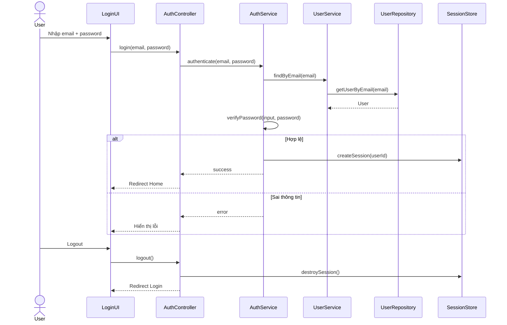
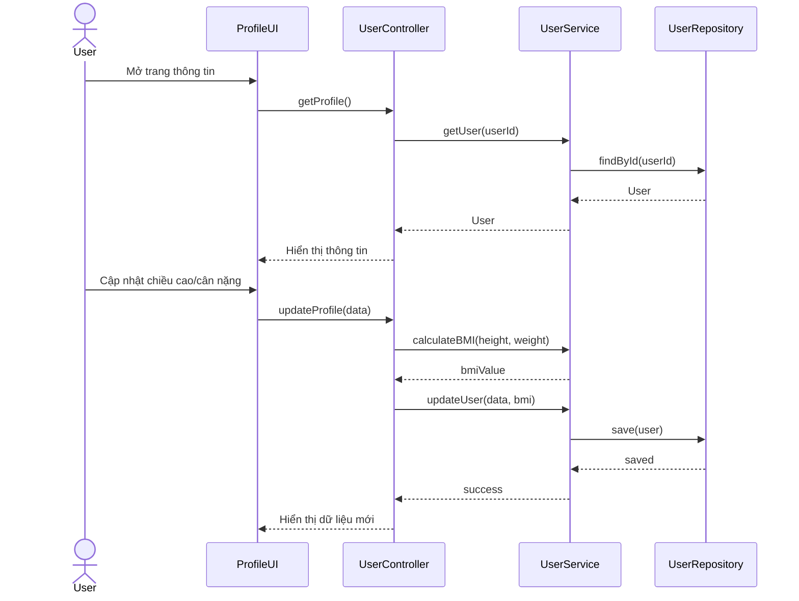
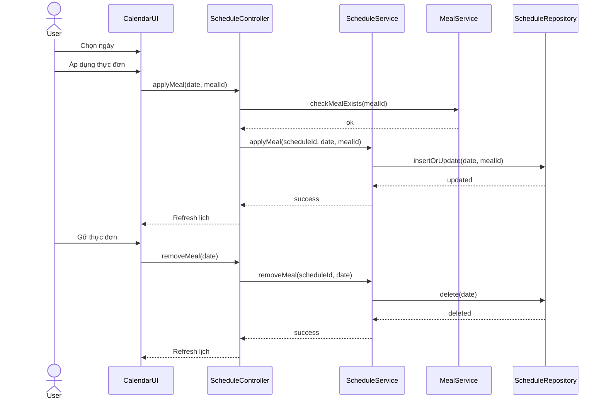
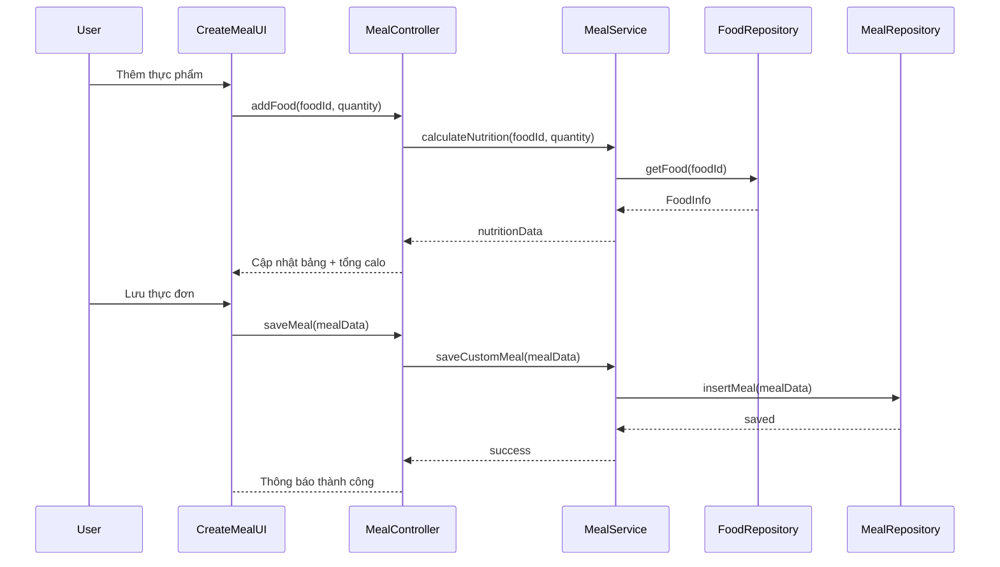
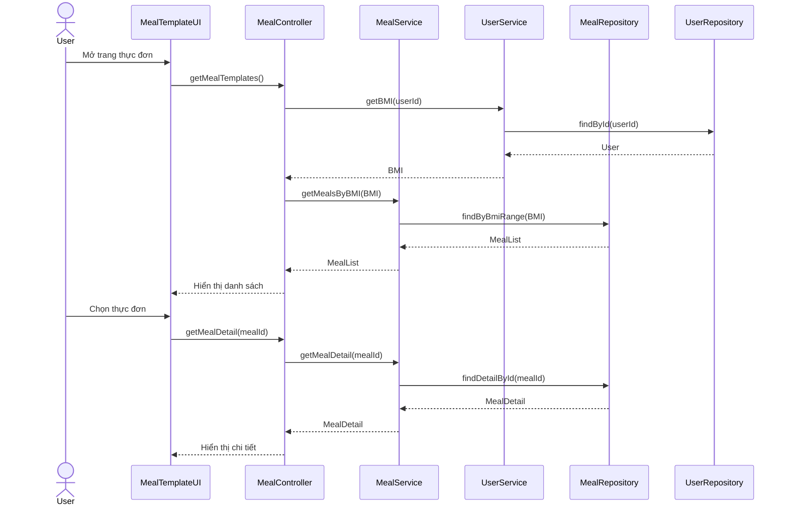

# BMI Meal Planner

**Trang web quản lý và xây dựng chế độ ăn phù hợp cá nhân**

---

## 1. Giới thiệu chung

**BMI Meal Planner** là một website hỗ trợ người dùng xây dựng và quản lý thực đơn ăn uống dựa trên chỉ số BMI cá nhân. 

Hệ thống cho phép người dùng nhập thông tin cơ thể như chiều cao, cân nặng, độ tuổi để đánh giá tình trạng sức khỏe hiện tại và đề xuất các thực đơn phù hợp với mục tiêu tăng cân, giảm cân hoặc duy trì cân nặng.

---

## 2. User Story

### Người dùng thông thường
Là một người dùng quan tâm đến sức khỏe, tôi muốn:
- Nhập các thông tin cá nhân như chiều cao, cân nặng và tuổi để hệ thống tự động tính chỉ số BMI
- Dựa trên BMI đó, xem các thực đơn mẫu phù hợp với mục tiêu tăng cân, giảm cân hoặc duy trì cân nặng
- Tự xây dựng thực đơn theo sở thích, kiểm soát lượng calo cho từng bữa ăn trong ngày
- Sắp xếp các thực đơn này vào lịch theo từng ngày trong tuần để dễ theo dõi và duy trì thói quen ăn uống khoa học

### Admin
Là một admin, tôi muốn:
- Xem danh sách người dùng cùng các thông tin chi tiết của mỗi người
- Xem các thống kê (thực đơn được sử dụng nhiều nhất, v.v.)

---

## 3. Các Use Case Chính

### 3.1. Use Case: Login / Logout

**Định nghĩa:**  
Cho phép người dùng đăng nhập vào hệ thống để sử dụng các chức năng cá nhân hóa và đăng xuất khi kết thúc phiên làm việc.

**Luồng hoạt động chính:**
1. Người dùng nhập email và mật khẩu
2. Hệ thống xác thực thông tin
3. Nếu hợp lệ → đăng nhập thành công
4. Người dùng có thể chọn đăng xuất bất cứ lúc nào
5. Hệ thống kết thúc phiên và quay về trang đăng nhập

**Actors / Components:**
- User
- Login UI
- AuthController
- AuthService
- UserService
- UserRepository
- SessionManager

**Sequence:**
1. User nhập email và mật khẩu trên Login UI
2. Login UI gửi request `login(email, password)` đến AuthController
3. AuthController gọi `authenticate(email, password)` của AuthService
4. AuthService gọi `findByEmail(email)` của UserService
5. UserService truy vấn UserRepository để lấy thông tin user
6. UserRepository trả về user (email, password, user_id)
7. AuthService so sánh mật khẩu nhập vào với password
8. **Nếu hợp lệ:**
   - AuthService yêu cầu SessionManager tạo session cho user
   - AuthService trả kết quả thành công cho AuthController
   - AuthController trả response đăng nhập thành công cho Login UI
9. **Nếu không hợp lệ:**
   - AuthService trả lỗi xác thực
   - AuthController trả thông báo lỗi cho Login UI
10. **Khi User logout:**
    - Login UI gửi request `logout()`
    - AuthController yêu cầu SessionManager hủy session
    - AuthController điều hướng về trang Login

---

### 3.2. Use Case: View / Update User Information

**Định nghĩa:**  
Người dùng xem và cập nhật thông tin cá nhân (tuổi, chiều cao, cân nặng); hệ thống tự động tính toán và hiển thị chỉ số BMI.

**Luồng hoạt động chính:**
1. Người dùng truy cập trang thông tin cá nhân
2. Hệ thống hiển thị thông tin hiện tại
3. Người dùng chỉnh sửa dữ liệu
4. Hệ thống tính BMI mới
5. Lưu thông tin và cập nhật thông tin mới

**Actors / Components:**
- User
- Profile UI
- UserController
- UserService
- UserRepository

**Sequence:**

**View:**
1. User truy cập trang thông tin cá nhân
2. Profile UI gửi request `getUserProfile()` đến UserController
3. UserController gọi `getUserById(userId)` của UserService
4. UserService truy vấn UserRepository lấy thông tin user
5. UserRepository trả về dữ liệu user
6. UserService trả dữ liệu cho UserController
7. UserController gửi dữ liệu sang Profile UI để hiển thị

**Update:**
1. User chỉnh sửa tuổi / chiều cao / cân nặng và nhấn lưu
2. Profile UI gửi request `updateProfile(data)` đến UserController
3. UserController gọi `calculateBMI(height, weight)` của UserService
4. UserService tính toán BMI và trả kết quả
5. UserController gọi `updateUser(data, bmi)` của UserService
6. UserService cập nhật thông tin trong UserRepository
7. UserRepository xác nhận lưu thành công
8. UserController trả dữ liệu mới cho Profile UI

---

### 3.3. Use Case: View Meal Templates & Meal Template Details

**Định nghĩa:**  
Cho phép người dùng xem danh sách các thực đơn mẫu và xem chi tiết từng thực đơn, dựa trên mục tiêu và chỉ số BMI.

**Luồng hoạt động chính:**
1. Người dùng truy cập trang thực đơn mẫu
2. Hệ thống lấy BMI của người dùng
3. Hiển thị danh sách thực đơn phù hợp (hoặc tất cả thực đơn)
4. Người dùng chọn một thực đơn
5. Hệ thống hiển thị chi tiết thực đơn

**Actors / Components:**
- User
- MealTemplate UI
- MealController
- MealService
- UserService
- BmiService
- MealRepository
- UserRepository

**Sequence:**

**Xem danh sách thực đơn:**
1. User truy cập trang thực đơn mẫu
2. MealTemplate UI gửi request `getMealTemplates()` đến MealController
3. MealController gọi `getBMI(userId)` của UserService
4. UserService truy vấn UserRepository lấy BMI
5. UserRepository trả về dữ liệu user
6. MealController gọi `getMealsByBMI(BMI)` của MealService
7. MealService truy vấn MealRepository theo BMI range
8. MealRepository trả về danh sách thực đơn
9. MealController trả danh sách cho UI hiển thị

**Xem chi tiết thực đơn:**
1. User chọn một thực đơn
2. UI gửi request `getMealDetail(mealId)`
3. MealController gọi `getMealDetail(mealId)` của MealService
4. MealService truy vấn MealRepository
5. MealRepository trả về chi tiết thực đơn (bao gồm danh sách thực phẩm)
6. MealController trả dữ liệu chi tiết cho UI

---

### 3.4. Use Case: Create Own Meal

**Định nghĩa:**  
Người dùng tự xây dựng thực đơn của riêng mình bằng cách chọn thực phẩm, định lượng và phân chia theo các bữa ăn.

**Luồng hoạt động chính:**
1. Người dùng truy cập trang tạo thực đơn
2. Chọn bữa ăn (sáng/trưa/tối)
3. Thêm thực phẩm và định lượng
4. Hệ thống tính tổng calo và dinh dưỡng
5. Người dùng lưu thực đơn

**Actors / Components:**
- User
- CreateMeal UI
- MealController
- MealService
- FoodRepository
- MealRepository

**Sequence:**

**Tạo thực đơn:**
1. User truy cập trang tạo thực đơn
2. User chọn bữa ăn (sáng/trưa/tối)
3. User thêm thực phẩm và định lượng
4. CreateMeal UI gửi request `addFood(foodId, quantity)` đến MealController
5. MealController gọi `calculateNutrition(foodId, quantity)` của MealService
6. MealService truy vấn FoodRepository lấy thông tin thực phẩm
7. FoodRepository trả về calo và dinh dưỡng
8. MealService tính tổng dinh dưỡng và trả về MealController
9. MealController gửi dữ liệu cập nhật cho UI hiển thị

**Lưu thực đơn:**
1. User nhấn lưu thực đơn
2. UI gửi request `saveCustomMeal(mealData)`
3. MealController gọi `saveCustomMeal(mealData)` của MealService
4. MealService lưu dữ liệu vào MealRepository
5. MealRepository xác nhận lưu thành công
6. MealController trả thông báo thành công cho UI

---

### 3.5. Use Case: Apply / Remove Meal to/from Calendar

**Định nghĩa:**  
Người dùng áp dụng hoặc gỡ bỏ thực đơn vào lịch theo từng ngày để quản lý chế độ ăn uống.

**Luồng hoạt động chính:**
1. Người dùng mở trang lịch thực đơn
2. Chọn ngày trong tuần
3. Chọn thực đơn để áp dụng hoặc gỡ bỏ
4. Hệ thống cập nhật lịch
5. Hiển thị lịch mới nhất

**Actors / Components:**
- User
- Calendar UI
- ScheduleController
- ScheduleService
- MealService
- ScheduleRepository

**Sequence – Apply:**
1. User mở lịch thực đơn
2. User chọn ngày và thực đơn
3. Calendar UI gửi request `applyMeal(date, mealId)`
4. ScheduleController gọi `checkMealExists(mealId)` của MealService
5. MealService xác nhận thực đơn tồn tại
6. ScheduleController gọi `applyMeal(scheduleId, date, mealId)` của ScheduleService
7. ScheduleService lưu dữ liệu vào ScheduleRepository
8. ScheduleRepository xác nhận cập nhật
9. ScheduleController trả lịch mới cho UI

**Sequence – Remove:**
1. User chọn gỡ thực đơn
2. UI gửi request `removeMeal(date)`
3. ScheduleController gọi `removeMeal(scheduleId, date)` của ScheduleService
4. ScheduleService xóa dữ liệu trong ScheduleRepository
5. ScheduleRepository xác nhận xóa
6. UI hiển thị lịch đã cập nhật

---

## 4. Mô hình ERD

[Xem ERD Diagram](https://drive.google.com/file/d/1-2kOwPgOBJfjVSSXNm6XH10PNPk6LzTl/view?usp=sharing)

---

## 5. Lược đồ quan hệ

### Users
```
(user_id [PK], email, password, name, age, height_cm, weight_kg, bmi, user_image)
```

### Lịch chứa các thực đơn người dùng
```
(schedule_id [PK], user_id [FK])
```

### Lịch-Thực đơn mẫu
```
(schedule_id [FK], idmf [FK], date, [PK: (schedule_id, idmf)])
```

### Thực đơn mẫu
```
(idmf [PK], meal_name, type, calo, chất_béo, chất_xơ, chất_đạm, carb, bmi_min, bmi_max)
```

### Thực phẩm để xây dựng thực đơn
```
(food_id [PK], tên_thực_phẩm, định_lượng, calo_per_100g, đạm, chất_béo, chất_xơ, carb, food_image)
```

### Chi tiết thực đơn
```
(idmf [FK], food_id [FK], quantity, meal_time(breakfast/lunch/dinner), [PK: (idmf, food_id)])
```

---

## 6. UI/UX Design

[Xem Figma Prototype](https://www.figma.com/proto/RYK36L9kG7SdiA6h7jHQj9/meal-planner?node-id=1-161&p=f&t=N8yT7U480japOYzz-1&scaling=contain&content-scaling=fixed&page-id=0%3A1&starting-point-node-id=1%3A390&show-proto-sidebar=1)

---

## 7. Sequence Diagrams (Mermaid)

### 7.1. Login/Logout



---

### 7.2. View/Update Profile



---

### 7.3. Select/Remove Meal



---

### 7.4. Create Meal



---

### 7.5. View Meal List



---

## 8. Công nghệ sử dụng

### Backend
- **Framework:** Spring Boot
- **Database:** MySQL/PostgreSQL (cần kết nối)
- **ORM:** Spring Data JPA
- **Authentication:** Spring Security (Session-based)

### Frontend
- **HTML5/CSS3/JavaScript**
- **Templates:** Thymeleaf
- **UI Framework:** Custom CSS

---

## 9. Hướng dẫn cài đặt

### Yêu cầu
- Java 17 hoặc cao hơn
- Maven 3.6+
- MySQL/PostgreSQL database

### Các bước cài đặt

1. **Clone repository**
   ```bash
   git clone <repository-url>
   cd Meal_planner_vip
   ```

2. **Cấu hình database**
   
   Chỉnh sửa file `src/main/resources/application.properties`:
   ```properties
   spring.datasource.url=jdbc:mysql://localhost:3306/meal_planner
   spring.datasource.username=your_username
   spring.datasource.password=your_password
   spring.jpa.hibernate.ddl-auto=update
   ```

3. **Build project**
   ```bash
   mvn clean install
   ```

4. **Run application**
   ```bash
   mvn spring-boot:run
   ```

5. **Truy cập ứng dụng**
   
   Mở trình duyệt và truy cập: `http://localhost:8080`

---

## 10. Cấu trúc thư mục

```
src/main/java/com/ronaldo/meal_planner_vip/
├── controller/          # REST Controllers
├── dto/                 # Data Transfer Objects
├── entity/              # JPA Entities
├── repository/          # JPA Repositories
├── service/             # Business Logic Services
└── MealPlannerVipApplication.java

src/main/resources/
├── application.properties
├── static/
│   ├── css/            # Stylesheets
│   ├── js/             # JavaScript files
│   └── images/         # Image assets
└── templates/          # Thymeleaf templates
```

---

## 11. Tác giả

- **Developer:** Ronaldo
- **Project Type:** Web Application - Meal Planning System
- **Date:** March 2026

---

## 12. License

This project is licensed under the MIT License.
